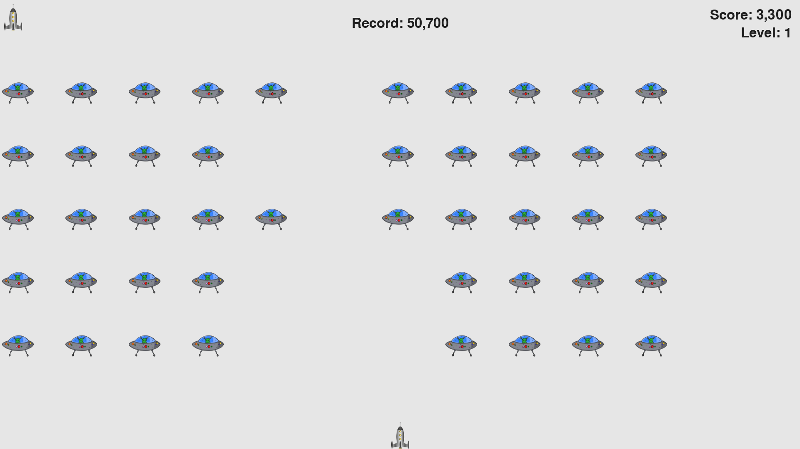

# Alien invasion



Steps for playing:

1. Get the project

```bash
git@github.com:Yurii-Solodzhuk/alien_invasion.git
cd alien_invasion
```

2. Configure venv

```bash
virtualenv -p python3 .venv
```

3. Activate venv

Linux:

```bash 
source .venv/bin/activate
```

Windows:

```bash 
.\.venv\Scripts\activate
```

4. Install requirements

```bash
pip install -r requirements.txt
```

5. Enjoy the game

```bash
python main.py
```